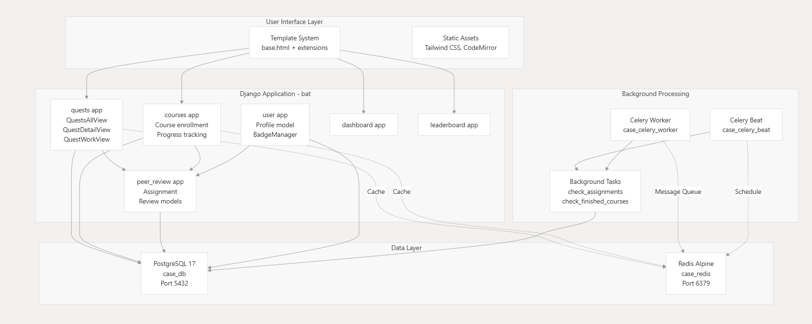

# BattleCode — Gamified Coding Education Platform

BattleCode is a Django-based gamified learning platform where users complete coding quests, earn badges, compete on leaderboards, and participate in a structured peer-review system.

This repository provides a local development environment for BattleCode using Docker, `uv` for dependency management, and Just for task automation.

---

## 📦 Prerequisites

Make sure the following are installed on your system:

- **Python** ≥ 3.12  
- **Docker** (latest)  
- **Docker Compose** (latest)  
- **uv** (latest) — fast Python package manager  
- **Git** (latest)

---

## 🚀 Quick Start

```bash
git clone https://github.com/TolyanL/school21-case.git
cd school21-case
make launch
```

The application will be available at:  
- **Frontend**: http://localhost:8000  
- **Admin**: http://localhost:8000/admin  

Default superuser credentials (from `.env`):  
- Username: `admin`  
- Password: `123`

> The `make launch` command handles everything: dependency installation, Docker services startup, migrations, and server launch.

---

## 🗂 Project Structure

```
battlecode/                 # Main Django project
├── quests/                 # Quest logic
├── user/                   # User profiles, points, badges
├── courses/                # Course structure & progress
├── peer_review/            # Peer feedback system
├── leaderboard/            # Ranking system
├── dashboard/              # User activity overview
├── user_auth/              # Authentication & 2FA
├── manage.py
├── ...
pyproject.toml              # Dependencies (managed by uv)
uv.lock                     # Locked dependency versions
Justfile                    # Development task automation
docker-compose.dev.yaml     # Local services (PostgreSQL, Redis, Celery)
.env.example                # Environment template
```

---

## ⚙️ Environment Setup

1. Copy the example environment file:
   ```bash
   cp .env.example .env
   ```
2. Edit `.env` if you need custom DB credentials, Redis settings, or admin details.

---

## 🐳 Docker Services

The dev environment runs 5 containers:

| Service               | Role                        | Image / Command                        |
|-----------------------|-----------------------------|----------------------------------------|
| `case_db`             | PostgreSQL database         | `postgres:17-alpine`                   |
| `case_redis`          | Cache & Celery broker       | `redis:alpine`                         |
| `case_celery_beat`    | Periodic task scheduler     | `celery -A battlecode beat -l info`    |
| `case_celery_worker`  | Async task processor        | `celery -A battlecode worker -l info`  |
| `case_web`            | Django dev server           | `python manage.py runserver 0.0.0.0:8000` |

---

## 🛠 Development Commands (`Justfile`)

| Command           | Description                                  |
|-------------------|----------------------------------------------|
| `just db_up`      | Start DB & Redis containers                  |
| `just db_migrate` | Run Django migrations                        |
| `just db_dw`      | Stop and remove DB containers                |
| `just serve`      | Start Django dev server                      |
| `just git-pull`   | Pull latest changes + sync dependencies      |

> Alternatively, use the `Makefile` if you prefer `make`:
> - `make run` — start services and server  
> - `make migrate` — apply migrations  
> - `make backup` — archive DB and static files  

---

## 🔒 Admin Setup

A superuser is **not** created automatically. After the server is running:

```bash
source .venv/bin/activate
python school21_case/manage.py createsuperuser
```

Or set `DJANGO_SUPERUSER_*` variables in `.env` before the first launch to auto-create one.

---

## 🧪 Testing

The project uses GitHub Actions for CI. To run tests locally:

```bash
uv sync --extra dev
cp .env.example .env
docker compose -f docker-compose.dev.yaml up -d --build
docker compose exec case_web python manage.py test
```

Linting is done with `ruff`:

```bash
just lint  # or: uv run ruff check battlecode
```

---

## 🔄 Updating the Project

To update to the latest version:

```bash
git checkout main
git pull
make migrate  # apply any new migrations
```

---

## 📁 Backups

Create a backup of the database and static files:

```bash
make backup
```

This runs `python manage.py archive` and stores output in the `backup/` directory.

---

## 📚 Next Steps

- Explore the [Installation & Setup](https://deepwiki.com/TolyanL/case-battlecode/2-getting-started) guide  
- Review available [Development Commands](https://deepwiki.com/TolyanL/case-battlecode/2-getting-started)  
- Study the [Technical Stack](https://deepwiki.com/TolyanL/case-battlecode/2-getting-started)

---

> Inspired by educational coding platforms like MIT Battlecode, this system adapts peer-driven learning to a web-based Django environment.
```